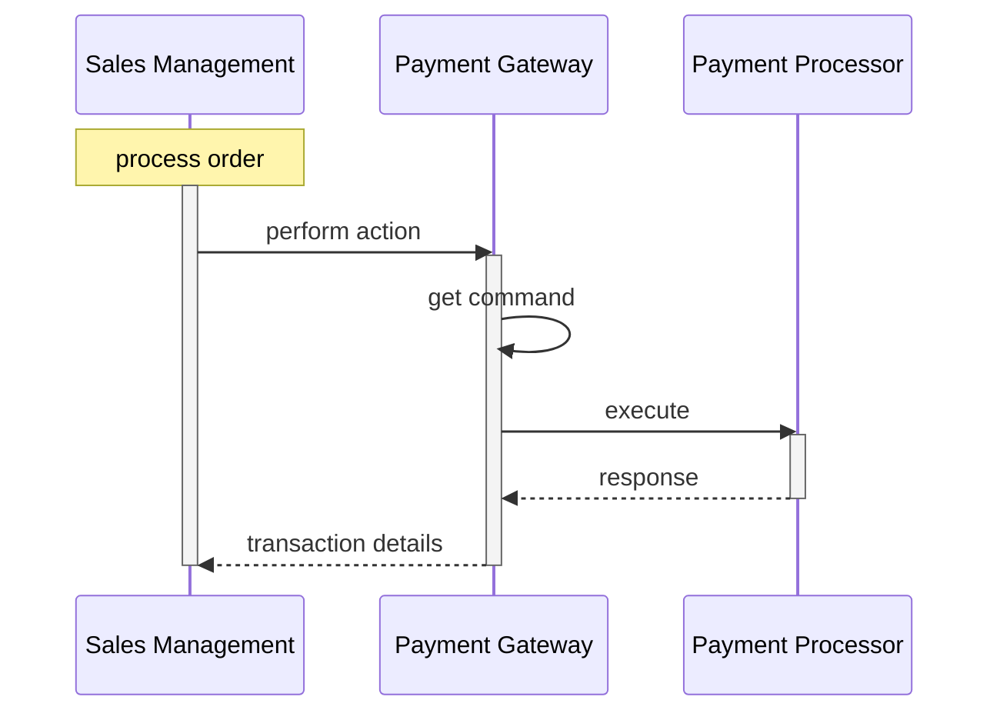

# Magento payment provider gateway

You can build useful diagrams to illustrate many types of content using the [mermaid plugin][mermaid]. Consider the following example of a Sequence diagram from the [DevDocs Payment Provider Gateway guide][payment]:

<!-- link definitions -->

[mermaid]: http://mermaid-js.github.io/mermaid/#/
[payment]: https://devdocs.magento.com/guides/v2.3/payments-integrations/payment-gateway/payment-gateway-intro.html
